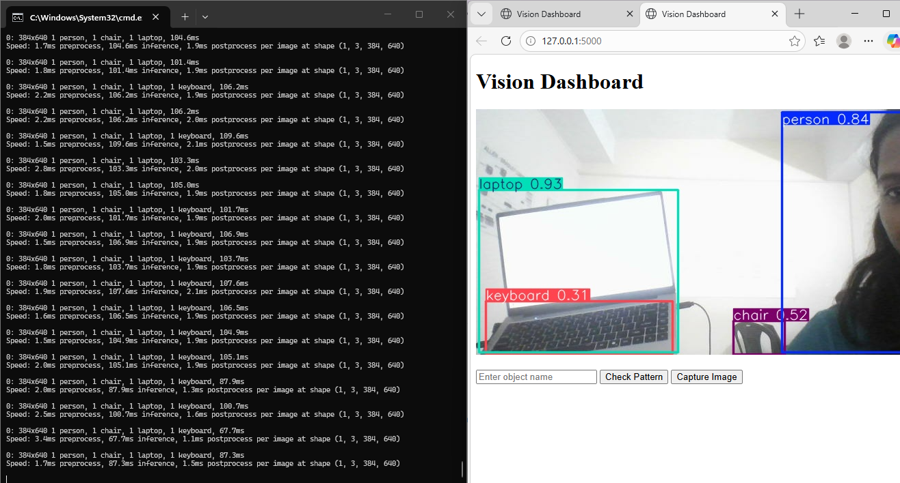

# Vision Dashboard – YOLO Object Detection

A real-time computer vision dashboard that performs object detection using **YOLOv8**, streams live camera footage, and allows capturing detected images through a simple web interface.

---

## 📌 Project Overview

The **Vision Dashboard** is a Python-based application that integrates computer vision with a web dashboard.  
It detects objects in real time using the YOLOv8 model and displays the results on a live video feed.

The system can also capture detected images and store them for review.

This project demonstrates how AI-based object detection can be integrated into a simple web application for monitoring and analysis.

---

## 🚀 Features

- 📷 Live camera streaming  
- 🎯 Real-time object detection using YOLOv8  
- 🖥 Web-based dashboard interface  
- 📸 Capture and save detected images  
- ⚡ Fast inference using Ultralytics YOLO  
- 🧩 Simple and modular Python code structure  

---

## 🛠 Technologies Used

- Python  
- OpenCV  
- Flask  
- YOLOv8 (Ultralytics)  
- HTML  
- CSS  

---

## 📂 Project Structure
vision-dashboard-yolo
│
├── app.py
├── data.yaml
├── templates/
│ └── index.html
├── static/
│ └── style.css
├── screenshots/
│ ├── detection1.png
│ └── detection2.png
└── README.md

---

### Object Detection Output

## ⚙️ Installation

Clone the repository:
git clone https://github.com/kiraha-lakshmie/vision-dashboard-yolo.git

Navigate to the project folder:

cd vision-dashboard-yolo

Install required dependencies:

pip install -r requirements.txt

---

## ▶️ Running the Project

Run the application:

python app.py

Then open your browser and go to:

http://127.0.0.1:5000

The dashboard will display the live camera feed and detected objects.

---

## 💡 Future Improvements

- Detection confidence threshold control  
- Object counting system  
- Detection history logging  
- Improved dashboard UI  
- Raspberry Pi camera integration  

---

